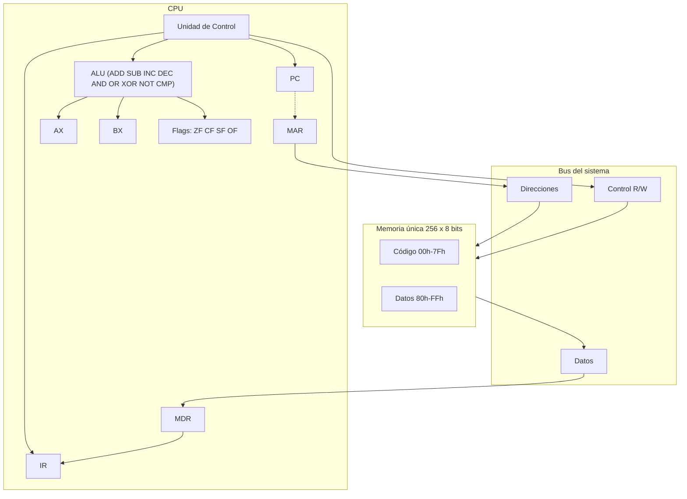

# Simulador de CPU de 8 bits (Arquitectura von Neumann)

**Materia:** Arquitectura de Computadoras (SIS131) — Primer Parcial
**Plataforma:** Google Sheets + Google Apps Script (`.gs`)
**Autor:** Josué Cartagena

Simulador interactivo y visual del ciclo completo de instrucción (**Fetch → Decode → Execute →
Store**) sobre una memoria principal de 256 bytes. Todo corre dentro de una hoja de Google Sheets
con Apps Script: registros, ALU, unidad de control, banderas (`ZF`, `CF`, `SF`, `OF`), ensamblador,
inspector de memoria y una suite de 63 pruebas automáticas.

## Documentos del proyecto

| Documento | Descripción |
|---|---|
| `README.md` | Este archivo: manual, arquitectura y decisiones de diseño. |
| [`docs/Informe-SimuladorCPU.pdf`](docs/Informe-SimuladorCPU.pdf) | Informe formal del proyecto (11 páginas). |
| [`docs/Informe-SimuladorCPU.odt`](docs/Informe-SimuladorCPU.odt) | Mismo informe, editable en LibreOffice. |
| [`docs/MANUAL_GOOGLE_SHEETS.md`](docs/MANUAL_GOOGLE_SHEETS.md) | Instalación paso a paso en Google Sheets. |
| [`docs/GITHUB_SETUP.md`](docs/GITHUB_SETUP.md) | Configuración del repositorio y del tablero. |
| [`docs/PASOS-PENDIENTES.md`](docs/PASOS-PENDIENTES.md) | Pasos manuales que quedan (F5, git push, tarjetas). |

## Contenido

1. [Arquitectura](#1-arquitectura)
2. [Memoria y `DATA_BASE`](#2-memoria-y-data_base)
3. [Registros y banderas](#3-registros-y-banderas)
4. [Conjunto de instrucciones (ISA)](#4-conjunto-de-instrucciones-isa)
5. [Ciclo de instrucción](#5-ciclo-de-instrucción)
6. [Manual de usuario](#6-manual-de-usuario)
7. [Programas de demostración](#7-programas-de-demostración)
8. [Ensamblador (hoja `ENSAMBLADOR`)](#8-ensamblador-hoja-ensamblador)
9. [Inspector de memoria y hoja Teoría](#9-inspector-de-memoria-y-hoja-teoría)
10. [Pruebas automatizadas](#10-pruebas-automatizadas)
11. [Estructura del repositorio y tarjetas de GitHub](#11-estructura-del-repositorio-y-tarjetas-de-github)
12. [Decisiones de diseño y lecciones](#12-decisiones-de-diseño-y-lecciones)
13. [Limitaciones conocidas](#13-limitaciones-conocidas)
14. [Bibliografía](#14-bibliografía)

---

## 1. Arquitectura




Es una arquitectura **von Neumann**: una sola memoria guarda instrucciones y datos, y comparten el
mismo bus. Lo único que las separa es la convención del simulador (código abajo, datos arriba).

## 2. Memoria y `DATA_BASE`

- 256 posiciones de 8 bits (`00h`–`FFh`), mostradas en una cuadrícula 16×16 (`G6:V21`).
- **Código** `00h–7Fh` (azul) y **datos** `80h–FFh` (amarillo).
- Primitivas: `readMem(state, dir)` y `writeMem(state, dir, valor)` (trunca a 8 bits).

**`DATA_BASE`** (`Program.gs`) es la *única* constante que define dónde viven los datos. Cada programa
calcula sus direcciones como `DATA_BASE + desplazamiento`; el código (operandos de `LOAD`/`STORE`),
la carga inicial de datos y el mensaje del log salen de esa misma cuenta, así que no pueden quedar
desincronizados. `validateDataAddrs_` rechaza datos dentro del código o más allá de `0xFF`.
Cada programa se prueba con datos en `0x80`, `0x90` y `0xC0`.

## 3. Registros y banderas

| Registro | Ancho | Función |
|---|---|---|
| `PC` | 8 bits | Dirección de la siguiente instrucción. |
| `IR` | — | Opcode + operandos de la instrucción en curso. |
| `MAR` | 8 bits | Dirección puesta en el bus de direcciones. |
| `MDR` | 8 bits | Dato que entra o sale de memoria. |
| `AX`, `BX` | 8 bits | Registros de propósito general. |
| `ZF` | 1 bit | Resultado igual a 0. |
| `CF` | 1 bit | Acarreo / préstamo **sin signo**. |
| `SF` | 1 bit | Bit 7 del resultado. |
| `OF` | 1 bit | Desbordamiento **con signo** (fuera de −128..127). |

`OF` y `CF` son distintas: `100 + 50 = 150` da `CF=0` (no pasa de 255) pero `OF=1` y `SF=1`
(150 se lee como −106). Está cubierto por una prueba y se ve en vivo con el programa Fibonacci
(`377 → 121`, con `CF=OF=1`).

## 4. Conjunto de instrucciones (ISA)

22 opcodes (`0x00`–`0x15`) de longitud variable: 1 byte de opcode + 0, 1 o 2 operandos. `AX=0`, `BX=1`.

| Opcode | Mnemónico | Bytes | Efecto |
|---|---|:-:|---|
| `0x00` | `HLT` | 1 | Detiene la ejecución |
| `0x01` | `MOV reg, imm` | 3 | `reg ← imm` |
| `0x02` | `MOV reg, reg` | 3 | `dst ← src` |
| `0x03` | `LOAD reg, [dir]` | 3 | `reg ← RAM[dir]` |
| `0x04` | `STORE [dir], reg` | 3 | `RAM[dir] ← reg` |
| `0x05` | `ADD reg, imm` | 3 | suma; flags |
| `0x06` | `ADD reg, reg` | 3 | suma; flags |
| `0x07` | `SUB reg, imm` | 3 | resta; flags |
| `0x08` | `SUB reg, reg` | 3 | resta; flags |
| `0x09` | `INC reg` | 2 | `reg + 1` |
| `0x0A` | `DEC reg` | 2 | `reg − 1` |
| `0x0B` | `CMP reg, imm` | 3 | solo flags |
| `0x0C` | `CMP reg, reg` | 3 | solo flags |
| `0x0D` | `AND reg, reg` | 3 | AND bit a bit |
| `0x0E` | `OR reg, reg` | 3 | OR bit a bit |
| `0x0F` | `XOR reg, reg` | 3 | XOR bit a bit |
| `0x10` | `NOT reg` | 2 | complemento a 1 |
| `0x11` | `JMP dir` | 2 | salto incondicional |
| `0x12` | `JZ dir` | 2 | salta si `ZF=1` |
| `0x13` | `JNZ dir` | 2 | salta si `ZF=0` |
| `0x14` | `JC dir` | 2 | salta si `CF=1` |
| `0x15` | `JNC dir` | 2 | salta si `CF=0` |

`JC`/`JNC` se agregaron al final de la tabla sin reordenar ningún opcode existente, para no romper
bytecode ya escrito. Implementación: `instrLength`, `mnemonic` y el `switch` de `executePhase` en
`Control.gs`.

## 5. Ciclo de instrucción

1. **Fetch** (`fetchPhase`): `MAR ← PC`, `MDR ← RAM[MAR]`, `IR ← MDR`, `PC ← PC + tamaño`.
2. **Decode** (`decodePhase`): la unidad de control interpreta el opcode del `IR`.
3. **Execute** (`executePhase`): la ALU opera o se resuelve el salto; se actualizan los flags.
4. **Store** (`storeBackPhase`): se escribe en memoria si la instrucción era `STORE`.

Cada fase pinta con un color propio el registro/celda activo y agrega una línea al log:

```
[Paso 03] FETCH:   MAR=0x09, MDR=0x12 -> IR=JZ 0x12
[Paso 03] DECODE:  Opcode=0x12 -> JZ 0x12
[Paso 03] EXECUTE: JZ 0x12 | ZF=0 CF=0 SF=0 OF=0
[Paso 03] STORE:   (esta instruccion no escribe en RAM)
```


## 6. Manual de usuario

Instalación completa en [`docs/MANUAL_GOOGLE_SHEETS.md`](docs/MANUAL_GOOGLE_SHEETS.md). Resumen:
copiar los 11 `.gs` al editor de Apps Script de la hoja, recargar (F5) y usar el menú
**CPU Simulador**.

| Acción | Qué hace |
|---|---|
| **Cargar programa ▸ 1–6** | Carga uno de los 6 programas de demostración. |
| **Step** | Avanza una fase del ciclo, animada. |
| **Run** | Ejecuta todo al instante y pinta la hoja una sola vez al final. |
| **Run Lento (1s/fase)** | Anima cada fase con 1 s de pausa (para exposiciones). |
| **Pause** | Detiene Run Lento sin perder el estado. |
| **Reset** | Limpia el log y recarga el programa. |
| **Ensamblar y cargar** | Ensambla la hoja `ENSAMBLADOR` y la carga en memoria. |
| **Inspeccionar celda de memoria…** | Muestra hex/bin/decimal con y sin signo. |
| **Conectar Diagrama / Construir hoja Teoria** | Preparación de una sola vez. |
| **Correr pruebas automatizadas** | Ejecuta la suite (63 pruebas). |
| **Actualizar hoja existente** | Agrega fila `OF`, entradas A/B y la hoja `ENSAMBLADOR`. |

Entradas en la hoja: `N` en `B22` (1–20), `Valor A` en `E21` y `Valor B` en `E22`.
Flujo típico: cargar programa → varios `Step` → `Reset` → `Run` o `Run Lento`.

## 7. Programas de demostración

| # | Programa | Resultado verificado |
|---|---|---|
| 1 | Suma de 1 a N | N=5 → `Mem[0x81]=15` (31 ciclos) |
| 2 | Multiplicación A×B por sumas sucesivas | 12×9 → 108 |
| 3 | C = A + B | 12+9 → 21 |
| 4 | Mayor de dos números (`CMP`+`JC`) | (12, 9) → 12 |
| 5 | Cuenta regresiva desde N | N=5 → 0 |
| 6 | Fibonacci hasta desbordar | 377 → 121, `CF=OF=1` (62 ciclos) |

Suma 1..N (obligatorio, con bucle y salto condicional):

```asm
0x00:  MOV  AX, 0x00
0x03:  LOAD BX, [0x80]     ; N
0x06:  CMP  BX, 0x00       ; L1
0x09:  JZ   0x12
0x0B:  ADD  AX, BX         ; opcode 0x06
0x0E:  DEC  BX
0x10:  JMP  0x06
0x12:  STORE [0x81], AX    ; L2
0x15:  HLT
```


## 8. Ensamblador (hoja `ENSAMBLADOR`)

Ensamblador de **dos pasadas** (`Assembler.gs`): la primera calcula direcciones y etiquetas, la
segunda emite los bytes. Admite comentarios (`;`), etiquetas (`ETIQUETA:`), `ORG`, `DB` y números
hex o decimales.

Se escribe el programa en la hoja **`ENSAMBLADOR`**, desde la celda **`A3`**, una instrucción por
fila (la hoja se crea sola con un ejemplo la primera vez). Luego: menú **Ensamblar y cargar**. Si
hay errores se listan con su número de línea y no se carga nada. Va en hoja propia porque en
`CPU_SIMULATOR` la columna A es el log.

## 9. Inspector de memoria y hoja Teoría

- **Inspector** (`Inspector.gs`): inspección por menú y **edición en vivo**: al editar una celda de
  la cuadrícula de memoria (`onEdit`) el valor se valida y se guarda en el estado.
- **Hoja `TEORIA`** (`Teoria.gs`): equivalencias entre los nombres de las láminas de clase
  (CP, RI, RDM, RIM, AC) y los del simulador (PC, IR, MAR, MDR, AX), más el ciclo de instrucción y
  la comparación von Neumann / Harvard.

## 10. Pruebas automatizadas

`runAllTests()` (`Tests.gs`) ejecuta **63 comprobaciones** sin tocar la hoja:

- **ALU:** suma, resta, flags `ZF`/`CF`/`SF`/`OF`, lógicas y `NOT`.
- **Ensamblador:** bytecode idéntico al de los programas, y errores esperados.
- **Programas:** los 6 programas, cada uno con datos en `0x80`, `0x90` y `0xC0`, más la validación
  de direcciones.

Usa las mismas `fetchPhase`/`decodePhase`/`executePhase`/`storeBackPhase` que la hoja real
(modo `Instant`), así que si se rompe `Control.gs` las pruebas lo detectan. Resultado: **63/63 OK**
(verificado en Node.js y dentro de Apps Script).

## 11. Estructura del repositorio y tarjetas de GitHub

```
apps_script/   Code, ALU, Control, Program, Program2, Setup, Datapath,
               Assembler, Inspector, Tests, Teoria  (.gs)
docs/          manual, informe (PDF/ODT), pasos pendientes
imgs/          capturas y diagramas
```

Cada archivo `.gs` lleva en su cabecera las tarjetas que implementa y cada función una etiqueta
`// [Tarjeta #N …]`.

| # | Tarjeta | Archivos principales |
|:-:|---|---|
| 1–6 | Arquitectura base, memoria, ISA, ciclo, programa de prueba, botones y visual | `Code`, `ALU`, `Control`, `Program`, `Setup`, `Datapath` |
| 7 | Bandera OF | `ALU`, `Setup`, `Datapath` |
| 8 | Saltos JC / JNC | `Control`, `Assembler` |
| 9 | Programas de demostración | `Program2`, `Setup` |
| 10 | Ensamblador | `Assembler` |
| 11 | Inspector y edición en vivo | `Inspector` |
| 12 | Pruebas automatizadas | `Tests` |
| 13 | Direcciones configurables (`DATA_BASE`) | `Program`, `Program2`, `Tests` |
| 14 | Hoja Teoría | `Teoria` |

## 12. Decisiones de diseño y lecciones

- **Direcciones configurables.** Mover los datos (p. ej. a `0x90`) debe cambiar solo `DATA_BASE`;
  el código, los datos y el log se derivan de ella.
- **`ADD` vs `SUB` (lección de la prueba).** El docente pidió modificar un byte del segmento de
  código. En `0x0B` debe estar `0x06` (`ADD AX, BX`); si queda `0x08` (`SUB`) el programa calcula
  `0xF1` en vez de `0x0F`. Cambiar direcciones de datos no altera esto, pero cambiar un opcode sí.
  Hoy lo cubren las pruebas de bytecode.
- **`OF` separada de `CF`.** Con signo y sin signo son interpretaciones distintas del mismo resultado.
- **Programas como funciones puras** que devuelven `{code, data}`: se reutilizan en la hoja, en el
  ensamblador y en las pruebas.
- **Un solo `onEdit`** (Apps Script solo permite uno simple): lo usa el inspector.
- **RUN instantáneo:** calcula todo en memoria y pinta una sola vez, porque cada `flush()` por fase
  costaba una ida y vuelta a Google Sheets.

## 13. Limitaciones conocidas

- La ISA no usa codificación sistemática por nibbles: se agregaron `JC`/`JNC` al final para no
  invalidar bytecode existente.
- No hay bus de datos animado: el diagrama colorea las cajas activas por fase y el log muestra
  `Read(dir)=valor` / `Write(dir,valor)`.
- Solo dos registros de propósito general (`AX`, `BX`).
- Máximo `N=20` en la suma, porque 1+…+20 = 210 cabe en 8 bits.

## 14. Bibliografía

- Stallings, W. *Organización y arquitectura de computadores.* Pearson.
- Tanenbaum, A. *Organización de computadoras: un enfoque estructurado.* Pearson.
- Material y láminas de clase de SIS131 — Arquitectura de Computadoras.
- Documentación de Google Apps Script: <https://developers.google.com/apps-script>
